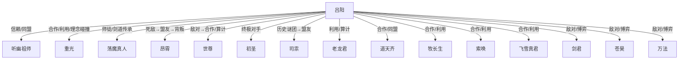

```markdown
# 《百世书》人物图谱（第1-27卷）

---

## 1. 主角：吕阳

### 1.1 性格特征
- **极度理性与冷静**：善于权谋、布局，能在极端压力下保持清醒，擅长多线操作与多重身份切换。
- **坚韧与适应力强**：多次死亡、重生后，面对绝境始终不屈，能迅速调整心态、吸收教训。
- **野心勃勃**：从最初的求生，到主动谋夺天下、挑战世界规则，目标不断升维。
- **现实主义与反道德英雄**：对修仙世界本质有深刻洞察，敢于利用、背叛、牺牲他人以达成目标，但对亲近者有底线。
- **高度自省与成长性**：不断反思自身局限，主动修正战略，敢于自斩、重开规避天道抹杀。

### 1.2 成长变化
- **炼气期底层→宗门真传→搅动天下格局的枢纽人物**
- **金丹真君→法身道大真君→元神道主→光海实际统治者**
- **从被动求生到主动布局，从棋子到棋手再到规则制定者**
- **能力开发**：“百世书”从简单轮回到锚点存档、吞噬天赋、剧外观测、历史重启等多重功能
- **理念升华**：从个人超脱到探索“众生皆可超脱”的新秩序，最终推动宇宙规则变革

### 1.3 核心动机
- **最初动机**：求生、复仇、在残酷修仙世界立足
- **中期动机**：突破修行极限，掌控自身命运，规避“果位陷阱”与“道主红线”
- **后期动机**：打破“彼岸”与“定数”统治，挑战道主体系，推动众生超脱，建立新世界规则
- **终极目标**：跳出光海体系，自建新“彼岸”，让“意义”归于众生而非道主

---

## 2. 主要配角

### 2.1 听幽祖师
- **身份**：巫鬼道残魂→吕阳炼制的幡灵→正统真君→一等真君
- **与主角关系**：最早的“工具人”与仆从，后成为最信赖的助手与智囊，核心战力
- **动机**：最初为求存，后为自身超脱与理念实现（“为天下人开上进之路”）
- **关系变化**：从被动依附到主动协作，最终成为吕阳新秩序的坚定执行者
- **阵营归属**：吕阳核心阵营
- **转折点**：证得“无忧天”果位、晋升一等真君，成为封神法推广主力

### 2.2 重光
- **身份**：初为圣宗师叔→求金失败者→圣宗代掌教→心魔/真魔
- **与主角关系**：合作→相互利用→理念碰撞→同盟（劫数计划执行者）
- **动机**：最初为证道，后为自我突破与理念实现（真魔之道、心魔劫）
- **关系变化**：合作与利用并存，后期成为吕阳“劫数”计划关键执行者
- **阵营归属**：吕阳阵营（后期）；曾为圣宗高层
- **转折点**：证得“无有天”后独立于三大道，成为第四大道的开创者

### 2.3 昂霄蔽日真君 / 凌霄东皇真君
- **身份**：剑阁阁主→冥府求道者→证道元婴失败→多次重生→被抹杀
- **与主角关系**：死敌→塑料盟友→致命背叛→博弈对手
- **动机**：证道元婴、超脱、复仇、掌控冥府
- **关系变化**：多次合作与背叛，最终成为吕阳终极博弈对手之一
- **阵营归属**：剑阁→冥府→个人势力
- **转折点**：与吕阳结盟探索天人残识，后背叛围杀吕阳；终极被圣宗祖师爷定数抹杀

### 2.4 世尊 / 广明
- **身份**：净土道主、因果道主、三世身成道者
- **与主角关系**：敌对→危险合作→相互算计
- **动机**：利用吕阳、昂霄等搅乱局势，谋求自身超脱与因果道主利益
- **关系变化**：从高高在上棋手到被吕阳、司祟等反制，后期合作对抗初圣
- **阵营归属**：净土→道主层→后期与吕阳、司祟临时同盟
- **转折点**：主动放弃道主之位、自焚金身，推动伪史回归

### 2.5 圣宗祖师爷（初圣/初圣道人）
- **身份**：圣宗开创者、彼岸路线最大受益者、定数道主
- **与主角关系**：幕后至高棋手→终极对手
- **动机**：维护彼岸体系、以众生为资粮、追求“真元婴”超脱
- **关系变化**：始终居高临下，后被吕阳、司祟等多方挑战，最终与司祟决裂
- **阵营归属**：圣宗、彼岸道主集团
- **转折点**：主动击碎彼岸引发千年大劫、与司祟在彼岸之上决战

### 2.6 司祟
- **身份**：上古道主、天府开创者、道心大道持有者
- **与主角关系**：历史上的“前辈”，后期成为吕阳实现超脱的关键盟友
- **动机**：追求“道心超脱”，反对彼岸独裁，最终成为太极道主
- **关系变化**：最初为历史谜团，后与吕阳并肩作战，最终超脱
- **阵营归属**：独立于现有道主体系，后期与吕阳、世尊同盟
- **转折点**：归还三大道，凭自身“我”之境界超脱，成为光海第二位超脱者

### 2.7 其他关键人物
- **荡魔真人**：吕阳剑阁师尊，人造剑灵，剑道果位布局者，后期以元神祭炼“诛天”剑助吕阳逆斩彼岸
- **牧长生**：听幽祖师弟子，后期被吕阳改写记忆成为封神法推广者
- **老龙君**：海外龙族之主，多次被吕阳算计、利用，后被剧外观测者天赋删除
- **飞雪真君**：初圣重要棋子，后期自爆润下果位破坏初圣计划，魂魄被神秘“第七人”接引
- **道天齐**：初代豢妖峰主，冥府开创者，后期与吕阳合作承接彼岸崩塌冲击
- **剑君、苍昊、万法**：其他彼岸道主，代表不同大道，与吕阳、司祟、初圣多次博弈

---

## 3. 阵营归属与势力关系

| 阵营          | 代表人物           | 主要目标/理念                     | 与主角关系           | 关系变化/备注           |
|---------------|--------------------|------------------------------------|----------------------|-------------------------|
| 吕阳核心阵营  | 吕阳、听幽、重光、荡魔、索唤、牧长生 | 打破彼岸、众生超脱、封神法新秩序   | 主角及亲密同盟       | 不断吸纳新成员，理念趋同 |
| 圣宗集团      | 初圣、飞雪真君等   | 维护彼岸体系、定数统治             |敌对→终极对手         |多次正面冲突             |
| 剑阁集团      | 昂霄、荡魔、刚形布道真君等 | 剑道证道、果位垄断                 |敌对→合作→背叛        |剑阁体系最终崩溃         |
| 净土集团      | 世尊、宝瓶水月菩萨等 | 因果道主、地上佛国                  |敌对→合作→自焚        |净土体系最终寂灭         |
| 道庭集团      | 嘉佑帝、道主等      | 仙国道律、牧场体系                  |敌对→合作→崩溃        |道庭被同化、失去独立性   |
| 冥府集团      | 道天齐、太皞真君等  | 冥府蓝图、第二彼岸                  |合作→同盟             |冥府承接彼岸崩塌         |
| 彼岸道主集团  | 剑君、苍昊、万法等  | 维持彼岸、道主垄断                  |敌对→博弈→被超脱者挑战|最终被司祟斩杀/击溃      |
| 司祟阵营      | 司祟                | 道心超脱、再造现世                  |盟友                   |最终超脱                 |

---

## 4. 重要人物关系转折点

- **吕阳与听幽祖师**：从工具人到最信赖的助手，听幽证道“无忧天”成为一等真君，成为新秩序的中坚。
- **吕阳与重光**：从合作到相互利用，重光证得真魔大道后成为“劫数”计划的关键执行者。
- **吕阳与昂霄**：多次合作与背叛，最终昂霄被圣宗祖师爷定数抹杀，吕阳获得其天赋。
- **吕阳与世尊**：从敌对到危险合作，世尊自焚金身推动伪史回归，与吕阳合谋对抗初圣。
- **吕阳与初圣**：从被操控棋子到终极对手，初圣主动击碎彼岸引发大劫，最终与司祟决战。
- **吕阳与司祟**：历史谜团到关键盟友，司祟超脱后成为光海第二位超脱者，推动宇宙规则变革。
- **吕阳与道天齐**：合作承接彼岸崩塌冲击，冥府成为新秩序支点。
- **吕阳与飞雪真君**：飞雪自爆润下果位破坏初圣计划，灵魂被神秘“第七人”接引，影响终极格局。
- **吕阳与老龙君**：多次算计、利用，最终以剧外观测者天赋“删除”其存在。
- **吕阳与剑君等道主**：从被动受制到主动挑战，最终在虚瞑与彼岸之上正面对决。

---

## 5. 关系图（简化版）



---

## 6. 总结

- 吕阳的成长与核心配角的关系变化，推动了世界格局与修行体系的每一次升维。
- 主要配角的动机与归属，既是主角成长的镜像，也是世界观演化的动力。
- 重要关系转折点（如证道、背叛、超脱、合作）直接影响故事主线与世界规则的变革。
- 阵营归属随剧情发展不断重组，最终聚焦于“超脱与定数”、“众生与道主”的终极对抗。
```