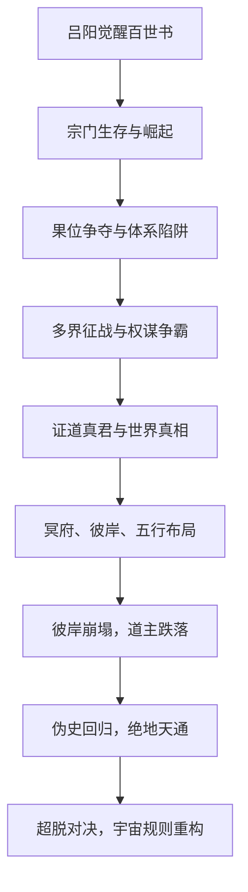

# 《百世书》第1-27卷主线剧情梳理

---

## 一、核心冲突与目标

### 1.1 核心冲突

- **主角吕阳**身怀“百世书”轮回系统，在残酷修仙世界中挣扎求生，逐步成长为搅动天下格局的关键人物。
- **终极冲突**：吕阳与世界规则制定者（道主）、幕后至高存在（圣宗祖师爷/初圣）、以及同为野心家的对手（昂霄、世尊等）之间的博弈。
- **世界本质冲突**：修行体系的掠夺性、道主对“彼岸”与“天道”路线的垄断，以及众生被当作资粮的残酷现实。
- **主角目标演变**：
  - 初期：求生、复仇、修行突破。
  - 中期：证道真君、争夺果位、揭开世界真相。
  - 后期：打破道主统治、重塑世界规则、实现众生超脱与自身超脱。

### 1.2 主线目标

- **个人目标**：从底层修士成长为主宰规则的超脱者，最终跳出“光海”体系，建立新“彼岸”。
- **世界目标**：打破道主垄断、终结“彼岸”体系，推动众生自由与修行新秩序的建立。

---

## 二、主线推进的关键转折点（时间顺序）

### 2.1 初始阶段（1-10卷）

1. **轮回系统觉醒**：吕阳在初圣宗试炼中觉醒“百世书”，开启死亡重启、保留收获的能力。
2. **宗门生存与崛起**：凭借轮回优势，反杀仇敌，炼化幡灵，获得因果遮蔽神符，筑基成功，成为真传。
3. **夺道之战与道基觉醒**：参与星辰界争夺，觉醒本命神通，获得天机至宝，完成从弟子到筑基真人的跃升。
4. **宗门权力与世界真相**：掌控补天峰，揭露碧阳修真界为域外天魔改造，炼化灵宝，协助击杀天魔，接受更高层次布局。
5. **果位争夺与体系陷阱**：助重光冲击果位失败，获得真功，揭示“空证”陷阱，明确三十年成就筑基圆满的时间线。
6. **多界布局与分身成长**：炼成分身采气，识破被昂霄操控，突破中期，转世为仙灵，发现大界天通道。
7. **天下大乱与果位突破**：参与天庭碎片争夺，见证重光证道，开启大争之世，分魂入冥府。
8. **天外世界与香火神道**：伪装鸿运真君，掠夺七曜天本源，炼成福地，窥见修行体系掠夺本质。
9. **真君果位与假死布局**：假持金位证得果位，击杀真君应身，假死谋划更高果位。
10. **至尊果位与权力真空**：锁定“天上火”果位，潜入道庭，发动刺杀风暴，乱世开启。

### 2.2 权谋与证道阶段（11-20卷）

11. **江东易主与至尊果位**：发动政变，建立新朝，证得“天上火”，创立正气道，遭道主联手伏击。
12. **天府金融风暴与上古秘辛**：潜入天府，发动金融风暴，揭示千年大劫与道主争夺化神之机的真相。
13. **修行体系真相与古法金丹**：洞悉洞天法缺陷，获得古法金丹传承，布局破坏昂霄谋划。
14. **天人残识争夺与三方博弈**：与昂霄结盟又反目，夺取至尊果位书册，正魔道争爆发。
15. **冲击大真君与冥府崩溃**：冲击大真君失败，昂霄发动冥府崩溃计划，吕阳重生布局新局。
16. **大劫主与劫数计划**：开创劫数神通，策划逼道主下界的超级大劫。
17. **彼岸崩溃计划与道主对决**：破坏冥府根基，千年大劫序幕拉开，仙枢大战，法身道重立。
18. **百世轮回抗争**：圣宗祖师爷镇压变局，吕阳开启百世轮回抗争，利用新天赋布局新局。

### 2.3 超脱与终极对决阶段（21-27卷）

19. **空证果位与冥府布局**：镇压老龙君，复刻果位，推动五行归位，设计新道统。
20. **冥府潜入与元婴丹计划**：潜入冥府，揭示元婴丹计划与祖龙、彼岸的终极阴谋。
21. **彼岸崩塌与轮回重启**：祖龙脱困，彼岸崩塌，道主跌落，吕阳重启轮回，开创封神法。
22. **封神法扩张与伪史潜入**：大规模传播封神法，布局伪史，策反多方势力。
23. **伪史崛起与绝地天通**：伪史回归，绝地天通，光海规则改造，道主混战。
24. **超脱对决与概念删除**：司祟超脱，初圣晋升真元婴，道主大战，司祟以天书删除“超脱”概念，宇宙规则根本改变。

---

## 三、伏笔的埋设与回收

### 3.1 主要伏笔埋设

- **百世书机制**：最初仅为轮回重开，后逐步揭示锚点存档、吞噬天赋、与世界规则的冲突。
- **果位体系与“空证”陷阱**：果位争夺与空证法的本质，实为道主诱捕外界存在的陷阱。
- **冥府与辰土之谜**：冥府作为彼岸蓝图的反面，辰土为果位篡改关键，昂霄本体所在。
- **五行至尊与彼岸结构**：五行果位与彼岸、天道的本质联系，祖龙、司祟、初圣的历史布局。
- **元婴丹计划与祖龙**：初代丹鼎峰主、补天峰主的元婴丹计划，实为锁死彼岸、逼初圣自毁的阴谋。
- **伪史与变数**：伪史作为历史修正场，变数对抗定数的根本手段。
- **超脱与天书**：超脱者的出现、天书的原始页，最终成为改变宇宙规则的关键。

### 3.2 伏笔回收

- **百世书与超脱**：最终成为对抗初圣、跳出光海体系的根本依仗。
- **果位体系崩溃**：五行解封、彼岸崩塌，果位体系被彻底打破。
- **冥府与祖龙**：祖龙脱困，彼岸以其为地基，最终被司祟和吕阳联手破局。
- **元婴丹计划**：丹被调包，成为彼岸崩塌的导火索。
- **伪史回归**：伪史回归现世，绝地天通，光海规则重塑。
- **超脱概念删除**：司祟以天书删除超脱概念，宇宙规则根本改变。

---

## 四、因果链条梳理

### 4.1 主要因果链

1. **吕阳觉醒百世书** → 多次死亡重启 → 实力成长 → 介入宗门、天下、界天、道主博弈。
2. **果位争夺** → 证道失败/成功 → 揭示果位体系陷阱 → 探索古法金丹、法身道 → 推动体系变革。
3. **冥府、彼岸、五行** → 祖龙、司祟、初圣布局 → 元婴丹计划实施 → 彼岸崩塌，道主跌落。
4. **伪史与变数** → 吕阳、司祟等利用伪史修正历史 → 绝地天通，光海新规则诞生。
5. **超脱与天书** → 司祟超脱，初圣晋升真元婴 → 超脱概念被删除，宇宙规则重构。

### 4.2 关键因果节点

- **每一次吕阳死亡/重启** → 新的布局与能力开发 → 影响后续博弈格局。
- **每一次果位争夺/体系突破** → 世界规则的进一步揭示与动摇。
- **每一次道主层面的对抗** → 世界结构与众生命运的根本变化。
- **每一次伪史修正** → 现实历史的重塑与新秩序的诞生。
- **最终司祟删除超脱** → 宇宙底层法则的根本改变，开启全新纪元。

---

## 五、结构化主线图谱

---

## 六、总结

- **主线剧情**：吕阳凭借百世书轮回，不断成长、布局、突破，最终将个人求生与世界规则变革结合，推动从宗门权谋到道主层面、再到宇宙法则的终极变革。
- **核心冲突**：个人超脱与世界规则、众生自由与道主垄断、历史因果与变数抗争。
- **关键转折**：每一阶段的死亡重启、果位突破、体系变革、伪史修正、超脱对决，都是主线推进的关键节点。
- **伏笔与因果**：多线埋设、逐步回收，形成环环相扣的因果链，最终在超脱概念删除中实现主线闭环。
- **未来展望**：宇宙规则已变，天地大不同，新纪元开启，主角与世界的故事进入全新阶段。