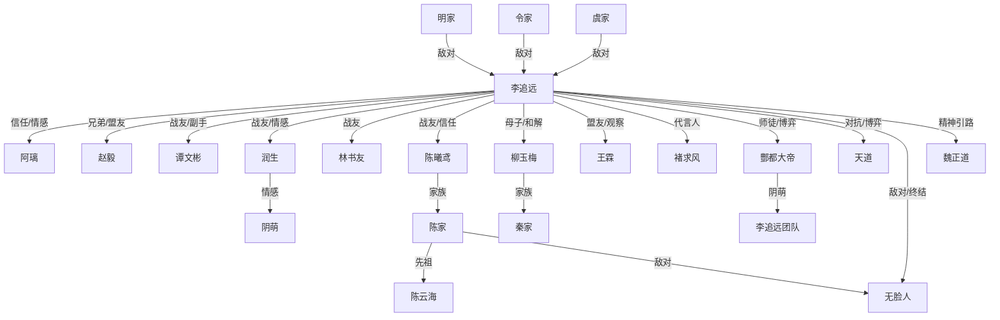

# 《捞尸人笔记》人物图谱（第1-11卷）

---

## 主角

### 李追远

- **性格特征**
  - 初期：敏感、聪明、坚韧，有少年人的善良与好奇。
  - 中期：理性冷静、善于布局，逐渐展现冷酷和果断。
  - 后期：心智极度成熟，部分情感被“本我”压制，善用“以恶制恶”，有极强的掌控欲和反抗精神。
- **成长变化**
  - 从普通少年到玄门新星，再到“龙王传人”“酆都少君”。
  - 经历“心魔噬主”，将理性“本我”收为工具，情感趋于冰冷。
  - 从被动应对危机到主动制造因果、挑战天道。
  - 完成与自身病症的和解，达成“并立”，彻底掌控自我。
- **核心动机**
  - 早期：自保、寻求亲情归属。
  - 中期：守护团队、复仇、追寻真相。
  - 后期：挑战天道、打破规则、建立新秩序。
  - 终极：成为“第二个魏正道”，挣脱天道枷锁，追求自由与掌控命运。

---

## 主要配角

### 1. 谭文彬
- **与主角关系**：最早的同伴，副手、外交官，李追远的“左膀右臂”。
- **动机**：最初因好奇和友情加入，后以团队利益为重，追求自我成长。
- **成长**：融合《五官封印图》，感官能力超凡，逐步独当一面。
- **关系变化**：从被动跟随到主动分担，成为团队不可或缺的支柱。
- **阵营归属**：李追远核心团队。

### 2. 润生
- **与主角关系**：忠诚伙伴，主力战将。
- **动机**：单纯善良，追求力量保护同伴。
- **成长**：修炼《秦氏观蛟法》，成为顶级战力；与阴萌情感线发展。
- **关系变化**：从“力气担当”到有独立情感和成长弧线的成员。
- **阵营归属**：李追远核心团队。

### 3. 林书友
- **与主角关系**：最初为官将首乩童，被李追远收服，后成“白鹤真君”，酆都鬼帅。
- **动机**：求生、追求力量与身份认同。
- **成长**：从边缘人到重要战力，获得地狱献祭台等独特能力。
- **关系变化**：对李追远从敬畏到信任。
- **阵营归属**：李追远核心团队。

### 4. 阴萌
- **与主角关系**：酆都大帝后人，团队成员，润生的情感对象。
- **动机**：家族责任、血脉誓言、个人情感。
- **成长**：多次献祭召唤先祖之力，因誓言滞留阴司。
- **关系变化**：与润生情感加深，团队羁绊强化。
- **阵营归属**：李追远核心团队。

### 5. 阿璃
- **与主角关系**：自闭症少女，李追远的情感支柱，家族默认为“娃娃亲”。
- **动机**：最初为生存与安全，后为陪伴李追远、追求自我价值。
- **成长**：病情因李追远好转，展现绘画与灵异天赋，成为团队重要一员。
- **关系变化**：与李追远情感羁绊极深，是唯一能感知其内心变化的人。
- **阵营归属**：李追远核心团队。

### 6. 赵毅
- **与主角关系**：九江赵家传人，最初竞争对手，后为生死同盟。
- **动机**：家族责任、个人野心、对李追远的认可与信任。
- **成长**：自毁生死门缝明志，成为李追远最可靠的盟友之一。
- **关系变化**：从对立到并肩作战，彼此托付生死。
- **阵营归属**：李追远核心团队（外援/盟友）。

### 7. 陈曦鸢
- **与主角关系**：龙王陈家传人，家族背叛后坚定站队李追远。
- **动机**：家族复兴、个人成长、对李追远的信任。
- **成长**：经历家族危机，域“虹”破而后立，成为可靠战力。
- **关系变化**：从合作到深度信任，成为团队重要成员。
- **阵营归属**：李追远核心团队（外援/盟友）。

### 8. 王霖
- **与主角关系**：新晋盟友，疑似“传承实验品”，与李追远有特殊记忆关联。
- **动机**：求生、寻找自我身份。
- **成长**：被揭示为实验品，关系转为盟友兼观察对象。
- **关系变化**：从陌生到信任，成为团队外围成员。
- **阵营归属**：李追远阵营（外围）。

### 9. 柳玉梅
- **与主角关系**：李追远母亲，秦家龙王传人。
- **动机**：家族责任、复仇、保护李追远。
- **成长**：从冷酷抛弃到母性觉醒，决意复仇，展现强大实力。
- **关系变化**：母子关系由疏离到温情和解。
- **阵营归属**：秦家（李追远阵营）。

### 10. 褚求风
- **与主角关系**：陈家成员，后投诚李追远，成为其在陈家的代言人。
- **动机**：家族利益、个人生存、对李追远的认可。
- **成长**：从陈家核心到李追远阵营代表。
- **关系变化**：由敌对到合作。
- **阵营归属**：李追远阵营（陈家分支）。

---

## 主要对手与高位存在

### 1. 酆都大帝
- **与主角关系**：阴司主宰，李追远的师父与棋手，亦敌亦友。
- **动机**：维护阴司秩序，利用李追远为棋子。
- **关系变化**：从高高在上到与李追远博弈、交易。
- **阵营归属**：阴司（独立高位）。

### 2. “无脸人”
- **与主角关系**：千年古老邪祟，因李追远毁其成仙路而布局复仇。
- **动机**：成仙、复仇、补全自身。
- **关系变化**：最终被李追远与陈云海联手消灭。
- **阵营归属**：邪祟阵营。

### 3. 虞家“老狗”
- **与主角关系**：窃居虞天南遗体的邪祟，掌控虞家。
- **动机**：权力、延续自身。
- **关系变化**：被李追远揭穿并镇压。
- **阵营归属**：邪祟阵营。

### 4. 明琴韵、令慕阳
- **与主角关系**：龙王明家、令家主事者，因果反噬后家族衰落。
- **动机**：家族利益、对抗李追远。
- **关系变化**：被李追远及柳玉梅清算。
- **阵营归属**：明家、令家（旧势力）。

### 5. 天道意志/“大乌龟”
- **与主角关系**：规则制定者，将李追远视为“清理工具”。
- **动机**：维持世界秩序，筛选“工具人”。
- **关系变化**：李追远从被动棋子到主动挑战天道，双方博弈升级。
- **阵营归属**：天道（至高规则）。

### 6. 陈云海
- **与主角关系**：陈家先祖、无冕龙王，短暂复活后认可李追远。
- **动机**：守护家族、反抗天道。
- **关系变化**：认可李追远为“魏正道之路”继承者。
- **阵营归属**：陈家（已消散）。

### 7. 魏正道
- **与主角关系**：前代传奇，李追远的精神引路人。
- **动机**：追求自由、反抗天道、求死。
- **关系变化**：李追远走上“第二个魏正道”之路。
- **阵营归属**：独立反抗者。

---

## 阵营归属一览

| 阵营           | 主要人物/势力                    | 现状与关系说明                       |
|----------------|----------------------------------|--------------------------------------|
| 李追远核心团队 | 李追远、谭文彬、润生、林书友、阿璃、阴萌 | 主角及其最亲密战友                  |
| 联盟/外援      | 赵毅、陈曦鸢、王霖、褚求风         | 由对立到合作，逐步整合进主角阵营    |
| 秦家           | 柳玉梅、秦力                      | 李追远母系家族，现与主角深度绑定    |
| 陈家           | 陈平道、姜秀芝、陈云海（已消散）、褚求风 | 经历大变，部分成员投诚主角           |
| 旧龙王门庭     | 明家（明琴韵）、令家（令慕阳）、虞家 | 被主角及其盟友清算、洗牌            |
| 阴司           | 酆都大帝、阴萌                   | 酆都大帝为高位博弈者，阴萌为团队成员|
| 天道           | 天道意志/大乌龟                  | 规则制定者，主角的终极对手          |
| 邪祟阵营       | 无脸人、虞家老狗等                | 主要反派势力，逐步被主角镇压        |

---

## 重要人物关系转折点

1. **李追远与母亲柳玉梅**
   - 早期被冷酷抛弃，后因危机逐步和解，最终母子温情达成。
   - 柳玉梅主动复仇，展现母性与家族责任。

2. **李追远与赵毅**
   - 从竞争对手到生死同盟，赵毅自毁生死门缝，完全信任李追远。

3. **李追远与陈曦鸢**
   - 经历家族背叛后坚定站队李追远，成为团队重要成员。

4. **李追远与酆都大帝**
   - 从被迫拜师到博弈交易，李追远逐步掌握主动权。

5. **李追远与天道**
   - 从被动“工具人”到主动挑战规则，天道视线被屏蔽，双方博弈升级。

6. **李追远与阿璃**
   - 阿璃成为唯一能感知并温暖李追远内心的人，情感羁绊极深。

7. **李追远与团队**
   - 团队从被动求生到主动谋势，成员各自成长，分工明确，凝聚力大增。

8. **李追远与陈家**
   - 从仇敌到复杂和解，揭露天道真相后获得陈家部分支持。

9. **团队成员间**
   - 润生与阴萌情感线深化，王霖身份揭示，团队内部关系更为复杂和紧密。

---

## 结构化关系图（简化版）

---

## 总结

- 李追远的成长与团队的凝聚是主线，核心人物间关系由疏离、猜忌到信任、共生。
- 主要配角均有独立成长线，动机清晰，关系随事件推进不断转折。
- 阵营归属动态变化，主角团队逐步吸纳外援、整合旧势力，形成新江湖格局。
- 重要转折点多与家族、信任、背叛、和解、天道博弈相关，推动故事层层递进。
- 目前主角已从被动棋子转为主动博弈者，团队分工明确，江湖与天道的终极对抗即将展开。